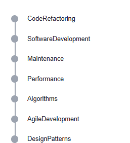
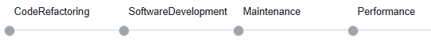
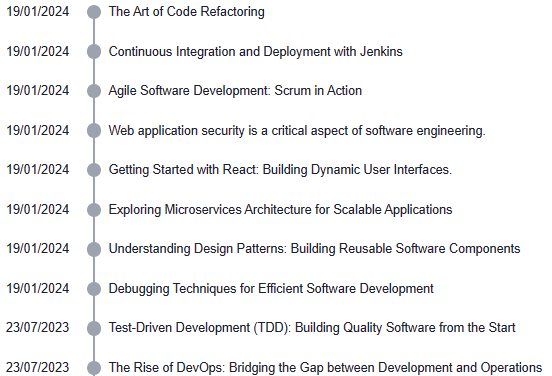
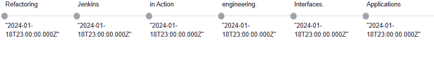
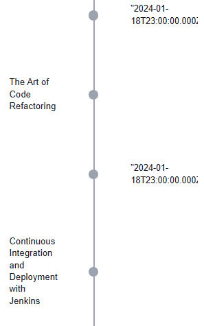

# Overview

Tags component for Qodly studio

## Timeline

Customizable component for visualizing chronological data with customizable styling.
Vertical timeline:

Horizontal timeline:

Vertical timeline with two sections:

Horizontal timeline with two sections :

Timeline Version 3:

## DataSource

| Name       | Type             | Description                                                                    |
| ---------- | ---------------- | ------------------------------------------------------------------------------ |
| Datasource | Entity Selection | Entity Selection that serves as the source of data for the timeline component. |

## Properties

| Name        | Type   | Description                                                                     |
| ----------- | ------ | ------------------------------------------------------------------------------- |
| variant     | string | property to represent the type of timeline.                                     |
| orientation | string | property to represent the orientation of the timeline (horizontal or vertical). |
